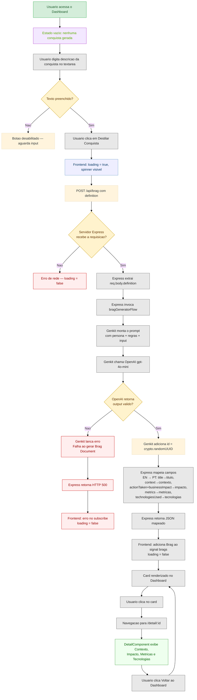

# BragBot

Aplicação Angular 21 com Tailwind CSS v4 que permite descrever conquistas profissionais e gerar cards estruturados com Contexto, Impacto, Métricas e Tecnologias.

## Setup

### Instalar Angular CLI e criar projeto
```bash
npm install -g @angular/cli && ng new brag-bot --ssr --style=css --routing
```

### Instalar dependências do projeto
```bash
cd brag-bot && npm install
```

### Instalar Tailwind CSS v4
```bash
npm install tailwindcss @tailwindcss/postcss postcss --force
```

### Instalar Genkit
```bash
npm install genkit @genkit-ai/compat-oai dotenv
```

### Configurar MCP (opencode.jsonc)
```json
{
  "$schema": "https://opencode.ai/config.json",
  "mcp": {
    "genkit": {
      "type": "local",
      "command": ["npx", "-y", "genkit-cli@1.40.1", "mcp", "--explicitProjectRoot", "--no-update-notification", "--non-interactive"],
      "cwd": ".",
      "enabled": true
    },
    "angular-cli": {
      "type": "local",
      "command": ["npx", "-y", "@angular/cli", "mcp"],
      "enabled": true
    }
  }
}
```

### Variáveis de ambiente
Crie um `.env` na raiz:
```
OPENAI_API_KEY=sua-chave-aqui
```

## Prompt (Spec 02)

```
Spec 02: Interface Visual UNIPDS e Mock de Dados
Contexto: Projeto Angular 21 com Tailwind CSS. O Genkit e o MCP já estão instalados.

Objetivos de Interface e Roteamento:
1. Acesse https://unipds.com.br/org-pos-ia/ e extraia a identidade visual.
2. Crie dois componentes standalone: `DashboardComponent` e `DetailComponent`. Configure o `app.routes.ts` para navegar entre eles (rota padrão para dashboard e `/detail/:id` para o detalhe).
3. Crie um `BragService` usando Angular Signals. Ele deve ter:
   - Um sinal `brags` que guarda um array de conquistas.
   - Um sinal `loading` (boolean).
   - Um método `generateMockBrag(prompt: string)` que simula uma chamada de rede (ex: `setTimeout` de 1.5s), ativa o loading, e depois adiciona um objeto JSON mockado estático (com Título, Contexto, Impacto e Tecnologias) na lista de `brags`.
4. No `DashboardComponent` (HTML):
   - Crie um Header com o título "Brag-Bot | Pós IA UNIPDS".
   - Crie um formulário com um `<textarea>` para a conquista bruta e um botão "Destilar Conquista". O botão deve mostrar um spinner ou mudar de texto enquanto `loading` for true.
   - Abaixo do formulário, use o laço `@for` do Angular para renderizar os "cards" das conquistas geradas. Cada card deve ser clicável, redirecionando para o `DetailComponent`.
5. No `DetailComponent` (HTML):
   - Renderize os detalhes completos da conquista (Contexto, Impacto, Métricas e Tecnologias) com um layout de leitura agradável. Adicione um botão para "Voltar ao Dashboard".
```

## Prompt (Spec 03)

```
Spec 03: Criação do Genkit Flow via MCP (Brag-Bot)

Instrução Prévia: USE O MCP DO GENKIT. Consulte o contexto do MCP conectado para utilizar a sintaxe correta da API do Genkit.

Atue como um Engenheiro de Software Sênior especialista na criação de aplicações baseadas em Inteligência Artificial utilizando o framework Firebase Genkit.

Sua tarefa é criar um arquivo TypeScript (`src/genkit.ts`) que defina os esquemas de dados e um fluxo do Genkit para transformar os rascunhos informais de um usuário sobre suas realizações no trabalho em um "Brag Document" profissional e bem estruturado.

Especificações Técnicas e de Configuração:
1. Importe `genkit` e `z` de `genkit`.
2. Importe o plugin do OpenAI: `openAI` do `@genkit-ai/compat-oai/openai`.
3. Inicialize a instância do Genkit, configurando-o para usar o plugin do OpenAI e definindo como modelo padrão o `gpt-4o-mini` com uma temperatura de `0.8`.

Especificação dos Schemas (utilize Zod e adicione `.describe()` em todos os campos para guiar a LLM):
1. `BragInputSchema`: Deve conter um campo `definition` (string), que será o rascunho informal do usuário.
2. `BragSchema` (o schema de saída rigoroso em JSON):
   - `title`: string (Ex: Ação principal + Resultado de alto nível).
   - `context`: string (Situação/Problema original. O que estava quebrado, lento, etc.).
   - `actionTaken`: string (Ação técnica ou estratégica passo a passo tomada para resolver o problema).
   - `businessImpact`: string (Qual o impacto de negócio. Tempo ganho, redução de falhas, etc.).
   - `metrics`: array de strings (Apenas dados estritamente quantificáveis. Ex: "50% reduction").
   - `technologiesUsed`: array de strings (Ferramentas, linguagens e plataformas mencionadas ou inferidas).

Implementação do Fluxo (Flow):
1. Crie e exporte um fluxo chamado `bragGeneratorFlow` usando `ai.defineFlow`.
2. Configure-o para receber o `BragInputSchema` e retornar o `BragSchema`.
3. No corpo do fluxo, construa uma string de `prompt` com o seguinte direcionamento:
   - Persona: O modelo deve atuar como um "Senior Career Consultant" focado em Planos de Desenvolvimento Individual (IDP) para Engenheiros de Software.
   - Objetivo: Transformar o rascunho informal do usuário em um "Brag Document" executivo.
   - Regra 1: Usar tom profissional, objetivo e focado em impacto, sem adjetivos emocionais.
   - Regra 2: Se não existirem métricas exatas, a IA deve inferir a natureza da métrica baseada na ação tomada.
   - Regra 3: Seguir ESTRITAMENTE o formato do schema JSON (`BragSchema`).
   - Regra 4: O output deve respeitar a linguagem original do input (se mandou em português, responde em português).
4. Inclua o `input.definition` ao final desse prompt.
5. Chame a geração de conteúdo do Genkit (`ai.generate`), passando o `prompt` montado e exigindo que o output obedeça ao `BragSchema`.
6. Verifique se existe um output válido; caso não exista, solte um erro (`throw new Error`).
7. O retorno final da função deve conter todas as propriedades mapeadas pela IA acrescidas de um campo `id` contendo a geração nativa de uma uuid (`crypto.randomUUID()`).
```

## Prompt (Spec 04)

```
Integração Final (Micro-BFF, HttpClient e Validação)
Contexto: O fluxo `bragGeneratorFlow` já existe. A interface já existe usando um serviço com dados "mockados".

Instruções para o Agente:
1. USE O MCP DO GENKIT: Consulte o contexto local se necessário para garantir a sintaxe.

2. Backend Seguro (server.ts):
   - Modifique o arquivo `server.ts` do Angular.
   - Logo após a inicialização do app Express (`const server = express();`), adicione `server.use(express.json());`
   - Crie uma rota `server.post('/api/brag', async (req, res) => {...})` ANTES da rota catch-all do Angular (`server.get('*')`).
   - Dentro da rota, extraia `req.body.definition`.
   - Invoque o `bragGeneratorFlow` passando exatamente o objeto `{ definition: req.body.definition }`.
   - Retorne o resultado em JSON. Em caso de erro, retorne status HTTP 500.

3. Configuração do Angular (app.config.ts):
   - Modifique `src/app/app.config.ts` para fornecer o HttpClient.
   - Utilize `provideHttpClient(withFetch())` para garantir compatibilidade perfeita com SSR.

4. Atualização do Serviço (brag.service.ts):
   - Remova completamente o método que gera dados "mockados".
   - Injete o `HttpClient`.
   - Crie o método real `generateBrag(definition: string)`.
   - O fluxo deve: ligar o signal `loading` (true), fazer um POST para `/api/brag` enviando `{ definition }`, adicionar o resultado da API ao signal da lista de brags, e desligar o `loading` (false). Trate possíveis erros.

5. Atualização do Flow Genkit (genkit.ts) — Detecção de Idioma:
   - O flow DEVE detectar o idioma do input (PT ou EN) via heurística simples (contagem de palavras-chave de cada idioma).
   - A instrução de idioma DEVE aparecer no TOPO do prompt, antes de qualquer outra regra, com formulação imperativa:
     "DETECÇÃO DE IDIOMA: O input abaixo está em ${idioma}. TODO o output DEVE ser escrito EXCLUSIVAMENTE no MESMO idioma do input. NUNCA misture idiomas. Esta é a regra mais importante."
   - Adicione um few-shot example condicional: se o input for em inglês, mostre um exemplo de output em inglês; se for em português, mostre em português.
   - Isso resolve o bug onde o modelo ignorava a regra de idioma e gerava sempre em PT-BR mesmo com input em inglês.

6. Validação de Build (CRÍTICO):
   - Após implementar todas as alterações acima, execute no terminal o comando de build do projeto (ex: `npm run build`).
   - Verifique a saída do terminal. Se o Angular apontar qualquer erro de compilação (TypeScript, dependências ausentes, falha no SSR), corrija o código autonomamente até que o build passe com sucesso.
```

## Fluxo da Aplicação



**Legenda:**

| Classe | Cor | Representa |
|---|---|---|
| `startend` | Verde claro | Início do fluxo |
| `empty` | Roxo claro | Estado vazio (sem conquistas) |
| `loading` | Azul claro | Spinner / aguardando resposta |
| `decision` | Amarelo | Pontos de branching |
| `action` | Cinza | Processos do sistema e interações |
| `success` | Verde | Conclusão com sucesso |
| `error` | Vermelho | Falhas e erros |

**Caminhos cobertos:**
- **Feliz**: input → POST → Genkit → OpenAI → mapeamento EN→PT → card → detalhe
- **Infelizes**: input vazio, erro de rede, OpenAI sem output válido, erro no Genkit, HTTP 500

## Comandos

### Desenvolvimento
```bash
npm start
```
Abre em `http://localhost:4200/` com hot reload.

### Build de produção
```bash
npm run build
```
Output em `dist/brag-bot/`.

### Servir build de produção
```bash
npm run serve:ssr:brag-bot
```
Roda em `http://localhost:4000/` com SSR.

### Testes
```bash
npm test
```

## Estrutura
```
src/app/
├── brag.service.ts          # Service com signals e mock
├── dashboard/
│   ├── dashboard.component.ts
│   └── dashboard.component.html
├── detail/
│   ├── detail.component.ts
│   └── detail.component.html
├── app.ts                   # Router outlet
├── app.routes.ts            # Rotas: / e /detail/:id
└── app.routes.server.ts     # SSR render modes
```

## Stack
- Angular 21 (standalone components, signals)
- Tailwind CSS v4
- Genkit + OpenAI (gpt-5.5)
- TypeScript
